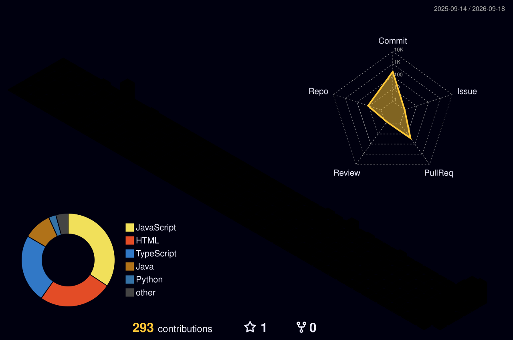

<p align="center">
  
</p>

<p align="center">

</p>

<p align="center">
<a href="http://abdullahadnan.me">Portfolio</a> •
<a href="https://www.linkedin.com/in/abdullah-adnan-660bb1350/">LinkedIn</a> •
<a href="mailto:chabdullah3506@gmail.com">Email</a>
</p>

<p align="center">


</p>

<p align="center">

</p>

## 👨‍💻 Who I Am


```ts
const abdullah = {
  title: "BS Software Engineering Student @ FAST-NUCES, Islamabad",
  stack: ["Java", "Spring Boot", "React", "Next.js", "Supabase", "Tailwind CSS",
          "C++", "Python", "Flask", "JavaFX", "SQL Server", "MySQL"],
  flagshipProject: "SDR_MIS — enterprise disaster response MIS on Spring Boot, React & SQL Server",
  projects: ["SDR_MIS", "Ocean Route Navigation", "BOGO", "FLAKE"],
  designPrinciples: ["OOP/OOD", "GRASP", "GoF Design Patterns",
                      "Layered Architecture", "MVC"],
  status: "Completed 4th semester | Focus: backend scalability, transactional systems, algorithmic performance",
  openTo: ["Internships", "Freelance Work"]
}
```

<p align="center">

</p>

## 🌟 Flagship Project

<div align="center">

### 🚨 [SDR_MIS](https://github.com/Abdullah-SE-bit/Smart-Disaster-Response-MIS) — Smart Disaster Response Management Information System


[](https://github.com/Abdullah-SE-bit/Smart-Disaster-Response-MIS/stargazers)
[](https://github.com/Abdullah-SE-bit/Smart-Disaster-Response-MIS/commits)
[](https://github.com/Abdullah-SE-bit/Smart-Disaster-Response-MIS)

</div>

An enterprise system, not a CRUD demo: emergency reporting, resource logistics, rescue team deployment,
hospital coordination, and financial tracking run behind a Spring Boot 3.2 REST API with **stateless JWT
authentication and method-level RBAC** across Admin, Operator, Field Officer, Warehouse Manager, and Finance
Officer roles. Data integrity is enforced in the database itself — **SQL Server triggers automate inventory
and team status**, views scope data per role, and composite indexes back the heavy queries. Resource
allocation, team dispatch, and financial transactions go through approval workflows with ACID rollback,
with audit logging and export on top.

| Layer | Choice |
|---|---|
| Backend | Spring Boot 3.2 + Spring Security + JPA (Hibernate) |
| Frontend | React 18 SPA + React Router + Axios + Chart.js + Tailwind CSS |
| Database | Microsoft SQL Server — 13 tables, triggers, role-scoped views, composite indexes |
| Auth | JWT (JJWT), stateless, `@PreAuthorize` method-level authorization |
| API Docs | OpenAPI / Swagger UI |

<p align="left">

</p>

**Code:** https://github.com/Abdullah-SE-bit/Smart-Disaster-Response-MIS

<p align="center">

</p>

## 🚀 More Projects

### Ocean Route Navigation — Maritime Route Planner
C++17 desktop application that models real global ports and scheduled sea routes as a weighted graph, computes cheapest and fastest paths under date and time constraints, and simulates bookings and ship movement on a rendered world map. Every core data structure is implemented from scratch.


<p align="left">

</p>

| Layer | Technology |
|---|---|
| Language | C++17 |
| Library | SFML |
| Algorithms | Dijkstra's, A* Search (Euclidean heuristic), BFS |
| Data Structures | Custom Vector, Queue, MinHeap, Linked Lists, Stacks |

**Code:** https://github.com/Abdullah-SE-bit/Ocean-Route-Navigation

<p align="center">

</p>

### BOGO — Bus Operations & Governance Organizer
Desktop public bus transport platform for route discovery, passenger booking, and fleet operations, built on a strict 5-layer architecture (UI → Controller → Service → Domain → Repository) aligned with GRASP and GoF patterns. DSA-driven map construction and pathfinding power route and stop lookup across the network, with separate Admin, Driver, and Passenger flows.


<p align="left">

</p>

| Layer | Technology |
|---|---|
| Application | Java, JavaFX |
| Database | Microsoft SQL Server (JDBC) |
| Architecture | Layered, GRASP, GoF Design Patterns |

**Code:** https://github.com/Abdullah-SE-bit/BOGO-v-2.0

<p align="center">

</p>

### FLAKE — University Student Portal
University portal consolidating attendance, marks, course registration, timetables, announcements, and Google Classroom-style academic workflows into one authenticated platform, with role-based access for Students, Teachers, and Admins and an in-built messaging system across all roles. MVC structure with repository and service layers.


<p align="left">

</p>

| Layer | Technology |
|---|---|
| Backend | Python, Flask |
| Database | SQLite, SQLAlchemy ORM, Alembic |
| Auth | Flask-Login, bcrypt, Flask-WTF (CSRF) |
| Realtime | Flask-SocketIO |

**Code:** https://github.com/Abdullah-SE-bit/Flake

<p align="center">

</p>

## 🛠 Tech Stack

**Languages**
<br/>


**Frontend**
<br/>


**Backend**
<br/>


**Database**
<br/>


*Also working with: Microsoft SQL Server, JavaFX, SFML*

**Dev Tools**
<br/>


<p align="center">

</p>

## 📈 GitHub Stats

<p align="left">


</p>

<p align="left">

</p>

<p align="left">

</p>

<p align="left">

</p>

### 🐍 Contribution Snake

<picture>
  <source media="(prefers-color-scheme: dark)" srcset="https://raw.githubusercontent.com/Abdullah-SE-bit/Abdullah-SE-bit/output/github-contribution-grid-snake-dark.svg" />
  <source media="(prefers-color-scheme: light)" srcset="https://raw.githubusercontent.com/Abdullah-SE-bit/Abdullah-SE-bit/output/github-contribution-grid-snake.svg" />
  
</picture>

### 🧊 3D Contribution Calendar



<p align="center">

</p>

## 📬 Connect

<p align="left">
<a href="http://abdullahadnan.me"></a>
<a href="https://www.linkedin.com/in/abdullah-adnan-660bb1350/"></a>
<a href="mailto:chabdullah3506@gmail.com"></a>
</p>

<p align="center">

</p>
